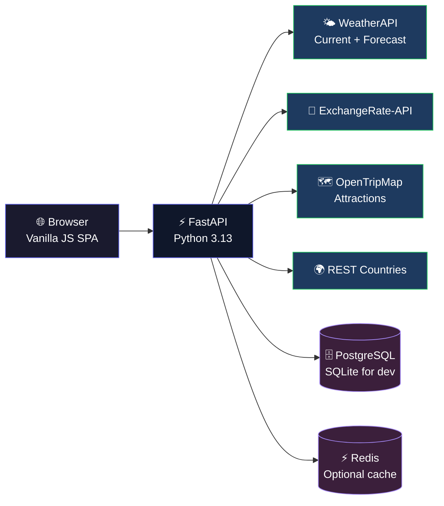

# NomadStack API — Travel Intelligence Platform

[](https://github.com/neoastra303/NomadStack-API/actions/workflows/ci.yml)
[](https://python.org)
[](https://fastapi.tiangolo.com)

NomadStack aggregates real-time weather, exchange rate, tourism, and country data to provide city travel scores with a polished SPA dashboard.



## Features

| Feature | Details |
|---|---|
| **City Search** | Live weather, exchange rate, travel score (0–100) with recommendation |
| **7-Day Forecast** | WeatherAPI forecast with rain %, emoji icons |
| **Nearby Attractions** | OpenTripMap radius query by category |
| **Country Info** | Flag, capital, population, currencies, languages |
| **Multi-City Compare** | Rank cities side-by-side by score, temp, condition |
| **User Auth** | Register/login with JWT, bcrypt passwords |
| **Favorites** | Save/remove cities per user |
| **Search History** | Browse past searches |
| **Theme** | Dark/light toggle, persisted in localStorage |
| **API Key Override** | Pass keys via `X-Weather-Api-Key` / `X-Exchange-Api-Key` headers |
| **Settings UI** | Store API keys in browser localStorage |
| **Map** | Leaflet map on search results |
| **Caching** | Redis (or no-op fallback) with per-endpoint TTL |
| **Security** | Rate limiting, security headers (CSP, HSTS), input validation |

## API Endpoints

| Method | Path | Description | Auth |
|---|---|---|---|
| `GET` | `/` | Serves the SPA | — |
| `GET` | `/health` | Health check | — |
| `GET` | `/api/v1/admin/health` | Deep system health (DB, cache, external APIs) | — |
| `GET` | `/api/v1/search?city=Paris&include=forecast,attractions,country` | Single city with extras | — |
| `GET` | `/api/v1/compare?cities=Paris,London,Tokyo` | Ranked multi-city | — |
| `GET` | `/api/v1/forecast?city=Paris&days=7` | Standalone forecast | — |
| `POST` | `/api/v1/auth/register` | Create account | — |
| `POST` | `/api/v1/auth/login` | Sign in | — |
| `GET` | `/api/v1/auth/profile` | Get profile | Bearer |
| `GET` | `/api/v1/me/favorites` | List favorites | Bearer |
| `POST` | `/api/v1/me/favorites` | Add favorite | Bearer |
| `DELETE` | `/api/v1/me/favorites/{city}` | Remove favorite | Bearer |
| `GET` | `/api/v1/me/history` | Search history | Bearer |

## Quick Start

```bash
# Clone and enter the project
cd NomadStack-API

# Configure environment
cp .env.example .env
# Edit .env with your API keys (WEATHER_API_KEY, EXCHANGE_RATE_API_KEY)

# Install dependencies
pip install -r requirements.txt

# Run the server
uvicorn app.main:app --reload
```

Open [http://127.0.0.1:8000](http://127.0.0.1:8000) in your browser.

### Environment Variables

| Variable | Required | Description |
|---|---|---|
| `DATABASE_URL` | Yes | PostgreSQL or `sqlite:///./nomadstack.db` |
| `SECRET_KEY` | Yes | JWT signing secret |
| `WEATHER_API_KEY` | For weather/forecast | [weatherapi.com](https://www.weatherapi.com) |
| `EXCHANGE_RATE_API_KEY` | For exchange | [exchangerate-api.com](https://www.exchangerate-api.com) |
| `OPEN_TRIP_MAP_KEY` | For attractions | [opentripmap.io](https://opentripmap.io) |
| `REDIS_URL` | Optional | Redis for caching |

## Project Structure

```
app/
├── api/endpoints/     # FastAPI route handlers (search, auth, favorites, admin)
├── core/              # Config, DB engine, exceptions, security
├── models/            # SQLAlchemy ORM models (User, Favorite, SearchHistory)
├── schemas/           # Pydantic V2 request/response models
├── services/          # External API clients + Redis cache
├── static/            # CSS, JS (vanilla, no build step)
├── templates/         # Jinja2 HTML template (SPA)
└── main.py            # FastAPI app, lifespan, middleware, static mount

tests/                 # pytest suite (schema, scoring, auth, endpoints, admin)
.github/workflows/     # CI pipeline (lint, typecheck, test, smoke test)
alembic/               # Database migrations
```

## Tests & CI

```bash
pytest tests/ -v          # Run test suite
ruff check app/ tests/    # Lint
mypy app/                 # Type check
```

The CI pipeline (`.github/workflows/ci.yml`) runs linting, type checking, the full test suite, and a server smoke test on every push.

## Deployment

### Fly.io

```bash
fly launch --from fly.toml
fly secrets set DATABASE_URL=... SECRET_KEY=... WEATHER_API_KEY=...
fly deploy
```

### Docker

```bash
docker-compose up -d
```

## Common Issues

- **`sqlite3.OperationalError: no such table`** — Run `uvicorn` once; tables are auto-created on startup.
- **502 from `/api/v1/search`** — Missing or invalid API keys. Set them in `.env` or via the Settings page.
- **`bcrypt` AttributeError** — Non-fatal warning; functionality works correctly.

## License

MIT
